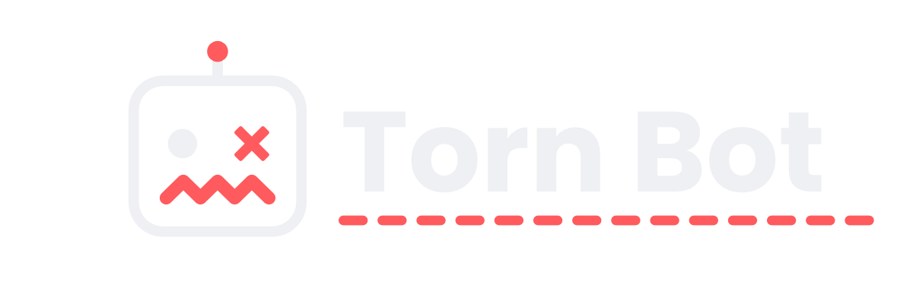
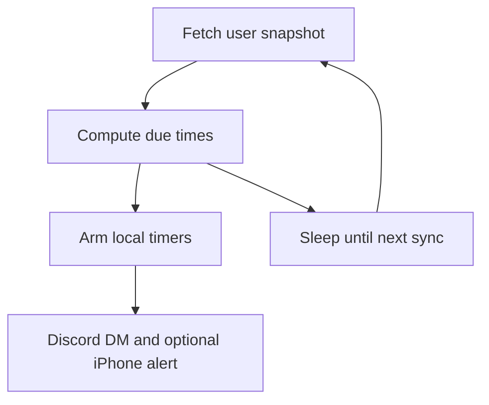

<h1 align="center">
  
</h1>

<p align="center">
  <i align="center">Discord and optional iPhone alerts when Torn timers finish</i>
</p>

<h4 align="center">
  <a href="./package.json">
    
  </a>
  <a href="https://www.typescriptlang.org/">
    
  </a>
  <a href="https://github.com/RRowDY/torn_notifier/graphs/contributors">
    
  </a>
</h4>

## Introduction

Torn Notifier messages you when Torn timers finish, on Discord and optionally on an iPhone through [ntfy](https://ntfy.sh). It uses Torn API v2 and one combined user request per sync. Alerts fire from local timers, so the bot does not call Torn every second.

The first successful Torn response is a baseline. Timers that are already done do not send a message. After a restart, the same rule applies.

<details open>
<summary>
 Features
</summary> <br />

| Alert     | Torn field             | Message                                          | Button         |
| --------- | ---------------------- | ------------------------------------------------ | -------------- |
| Energy    | `bars.energy.fulltime` | Energy is full                                   | Open gym       |
| Nerve     | `bars.nerve.fulltime`  | Nerve is full                                    | Open crimes    |
| Booster   | `cooldowns.booster`    | Booster cooldown is over                         | Open armory    |
| Drug      | `cooldowns.drug`       | Drug cooldown is over                            | Open items     |
| Health    | `cooldowns.medical`    | Health cooldown is over                          | Open armory    |
| Education | `education_timeleft`   | Education is finished                            | Open education |
| Bank      | `city_bank.time_left`  | Bank investment is over                          | Open bank      |
| Landing   | `travel.time_left`     | 30 seconds before landing, then 5 seconds before | Open travel    |

</details>

<details open>
<summary>
 How it stays quiet
</summary> <br />



Torn allows 100 API requests per minute. This bot uses one user request per sync:

`GET /v2/user?selections=bars,cooldowns,travel,education,money`

| Soonest timer             | Time until the next Torn request                    |
| ------------------------- | --------------------------------------------------- |
| Nothing in progress       | 5 minutes                                           |
| More than 15 minutes away | 10 minutes, and at least 2 minutes before the event |
| 2 to 15 minutes away      | 60 seconds                                          |
| Under 2 minutes           | 30 seconds                                          |

The alert is scheduled for `now + remaining seconds`. The next sync cancels that alarm if the remaining time changed. Discord and ntfy, when configured, both receive that alert.

</details>

## Usage

Copy `.env.example` to `.env` and fill in the values below. Do not commit `.env`.

### Torn API key

Create a custom key with only these user selections: `bars`, `cooldowns`, `travel`, `education`, `money`.
[Open the Torn key page with those selections filled in](https://www.torn.com/preferences.php#tab=api?step=addNewKey&title=Torn%20Notifier&user=bars,cooldowns,travel,education,money).
`money` is required for the bank investment timer. Put the key in `TORN_API_KEY`.

### Discord

1. Create an application at the [Discord Developer Portal](https://discord.com/developers/applications).
2. Open **Bot**, reset the token, and store it as `DISCORD_TOKEN`.
3. Turn on Developer Mode in Discord, then copy your user id into `DISCORD_USER_ID`.
4. Invite the bot to a private server you are in. In the OAuth2 URL Generator, select the `bot` and `applications.commands` scopes. No bot permissions are required. The bot DMs you and answers `/cooldowns`. It does not read messages.
5. In Discord privacy settings, allow direct messages from server members. Discord refuses the DM when you and the bot do not share a server.

### iPhone (ntfy)

Leave `NTFY_TOPIC` blank to use Discord only.

1. Install the ntfy app on the iPhone and allow notifications.
2. Choose a private topic: 16 to 64 characters, using only letters, numbers, `_`, and `-`. Put it in `NTFY_TOPIC`. Anyone who knows the topic can read its alerts, so keep it long and random.
3. In the app, subscribe to that topic. The server is `https://ntfy.sh` unless you set `NTFY_SERVER`.
4. Optional: an ntfy access token can reserve the topic. Put that token in `NTFY_TOKEN`. The bot sends `Authorization: Bearer` only when the token is set.

The iPhone notification uses the same text as the Discord DM. The view action opens the same Torn page.

<details>
<summary>
  Check timers
</summary> <br />

In a private server, or in your DM with the bot after Discord finishes publishing the global command, run `/cooldowns`.

The reply lists energy, nerve, booster, drug, and health. Education, bank, and travel are included only while they are in progress. A bank line also appears when money is invested and the investment is ready to collect. Only the Discord user in `DISCORD_USER_ID` can use the command, and only that user can see the reply.

</details>

## Development

Run Torn Notifier on your machine with Node.js, or in Docker after `.env` is filled in.

<details open>
<summary>
Pre-requisites
</summary> <br />

- Node.js 22 or newer (`engines.node` in [package.json](./package.json))
- npm
- Git
- Docker, when you want to run the container

</details>

<details open>
<summary>
Running Torn Notifier
</summary> <br />

1. Clone the repository and install dependencies:

```bash
git clone https://github.com/RRowDY/torn_notifier.git && cd torn_notifier && npm install
```

2. Copy `.env.example` to `.env` and fill in `DISCORD_TOKEN`, `DISCORD_USER_ID`, and `TORN_API_KEY`.

3. Check, build, and start:

```bash
npm test
npm run build
npm start
```

A healthy log line looks like `Next Torn sync in 300s`. Torn errors stay in the log and retry with a longer wait. They do not require a rebuild.

</details>

<details open>
<summary>
Docker
</summary> <br />

Install Docker Desktop first. From this folder, after `.env` is filled in and `package-lock.json` exists:

```bash
docker compose up -d --build
```

`docker-compose.yaml` builds the current Dockerfile and reads `.env`. `restart` is `no`, so the container stays stopped after it exits or the daemon restarts. The compose file caps RAM at 128 MB and CPU at a quarter of one core.

```bash
docker compose logs -f
docker compose stop
docker compose start
```

If a container from the earlier `docker run --name torn-notifier` command is still running, stop and remove it before starting Compose. Two running copies each send a Discord DM.

```bash
docker stop torn-notifier
docker rm torn-notifier
```

</details>

## Resources

- **[Torn API key page](https://www.torn.com/preferences.php#tab=api)** for a custom key limited to the selections this bot uses.
- **[Discord Developer Portal](https://discord.com/developers/applications)** for the bot application and token.
- **[ntfy](https://ntfy.sh)** for optional iPhone notifications.
- **[GitHub](https://github.com/RRowDY/torn_notifier)** for source code, issues, and pull requests.

<a name="contributing_anchor"></a>

## Contributing

Bug reports and pull requests are welcome on [GitHub](https://github.com/RRowDY/torn_notifier/issues).

## Contributors

<a href="https://github.com/RRowDY"></a>

## License

This repository does not include a license file.
