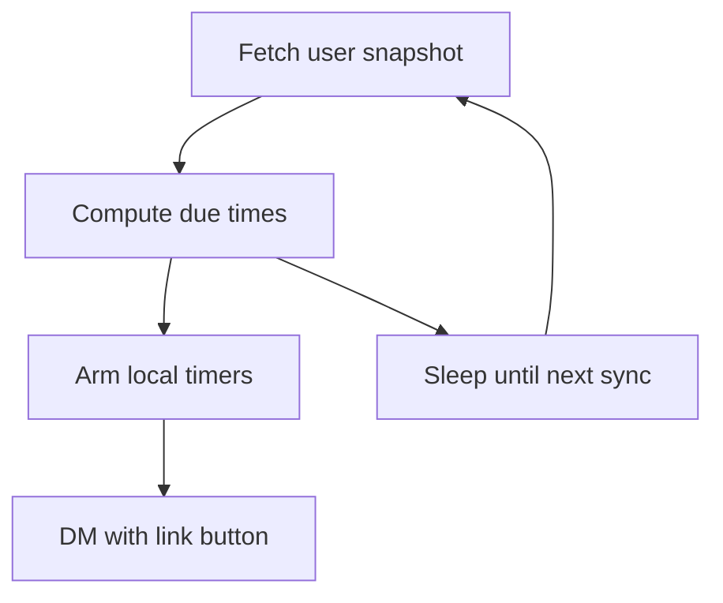

# Torn Notifier

Personal Discord bot that DMs you when Torn timers finish. It uses Torn API v2 and one combined user request per sync. Alerts fire from local timers, so the bot does not call Torn every second.

| Alert                                                                                                                                    | Torn field             | Message                                          | Button         |
| ---------------------------------------------------------------------------------------------------------------------------------------- | ---------------------- | ------------------------------------------------ | -------------- |
| Energy                                                                                                                                   | `bars.energy.fulltime` | Energy is full                                   | Open gym       |
| Nerve                                                                                                                                    | `bars.nerve.fulltime`  | Nerve is full                                    | Open crimes    |
| Booster                                                                                                                                  | `cooldowns.booster`    | Booster cooldown is over                         | Open armory    |
| Drug                                                                                                                                     | `cooldowns.drug`       | Drug cooldown is over                            | Open items     |
| Health                                                                                                                                   | `cooldowns.medical`    | Health cooldown is over                          | Open armory    |
| Education                                                                                                                                | `education_timeleft`   | Education is finished                            | Open education |
| Bank                                                                                                                                     | `city_bank.time_left`  | Bank investment is over                          | Open bank      |
| Landing                                                                                                                                  | `travel.time_left`     | 30 seconds before landing, then 5 seconds before | Open travel    |
| The first successful Torn response is a baseline. Timers that are already done do not send a DM. After a restart, the same rule applies. |

## Check timers

In the private server, or in your DM with the bot after Discord finishes publishing the global command, run `/cooldowns`.
The reply lists energy, nerve, booster, drug, and health. Education, bank, and travel are included only while they are in progress. A bank line also appears when money is invested and the investment is ready to collect. Only the Discord user in `DISCORD_USER_ID` can use the command, and only that user can see the reply.

## How it stays quiet



Torn allows 100 API requests per minute. This bot uses one user request per sync:
`GET /v2/user?selections=bars,cooldowns,travel,education,money`

| Soonest timer                                                                                                      | Time until the next Torn request                    |
| ------------------------------------------------------------------------------------------------------------------ | --------------------------------------------------- |
| Nothing in progress                                                                                                | 5 minutes                                           |
| More than 15 minutes away                                                                                          | 10 minutes, and at least 2 minutes before the event |
| 2 to 15 minutes away                                                                                               | 60 seconds                                          |
| Under 2 minutes                                                                                                    | 30 seconds                                          |
| The DM is scheduled for `now + remaining seconds`. The next sync cancels that alarm if the remaining time changed. |

## Torn API key

Create a custom key with only these user selections: `bars`, `cooldowns`, `travel`, `education`, `money`.
[Open the Torn key page with those selections filled in](https://www.torn.com/preferences.php#tab=api?step=addNewKey&title=Torn%20Notifier&user=bars,cooldowns,travel,education,money)
`money` is required for the bank investment timer. Put the key in `.env`. Do not commit `.env`.

## Discord

1.  Create an application at the [Discord Developer Portal](https://discord.com/developers/applications).
2.  Open **Bot**, reset the token, and store it as `DISCORD_TOKEN`.
3.  Turn on Developer Mode in Discord, then copy your user id into `DISCORD_USER_ID`.
4.  Invite the bot to a private server you are in. In the OAuth2 URL Generator, select the `bot` and `applications.commands` scopes. No bot permissions are required. The bot DMs you and answers `/cooldowns`. It does not read messages.
5.  In Discord privacy settings, allow direct messages from server members. Discord refuses the DM when you and the bot do not share a server.

## Local checks

Requires Node.js 22.

```bash
npm install
npm test
npm run build
```

`npm install` writes `package-lock.json`. Commit that file.

## Docker

Install Docker Desktop first. From this folder, after `.env` is filled in and `package-lock.json` exists:

```bash
docker build -t torn-notifier .
docker run -d --name torn-notifier --env-file .env --restart unless-stopped --memory 128m --cpus 0.25 torn-notifier
```

`--memory 128m` caps RAM at 128 MB. `--cpus 0.25` caps the container at a quarter of one CPU. `--restart unless-stopped` starts it again when Docker starts, until you stop it yourself.

```bash
docker logs -f torn-notifier
docker stop torn-notifier
docker start torn-notifier
```

A healthy log line looks like `Next Torn sync in 300s`. Torn errors stay in the log and retry with a longer wait. They do not require a rebuild.
The image does not include organized crime alerts.
